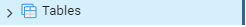
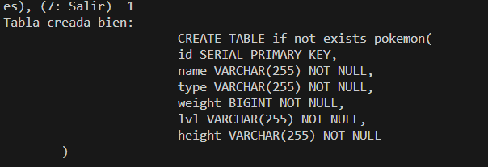

# CREATE TABLE

Antes de crear la tabla:

---

Creación de la tabla:

---

# CREATE

Antes del insert de un Pokémon:

---

Insert del Pokémon:

---

# READ

---

Select:

---

# UPDATE

Actualizo el dato:

---

Muestro el dato nuevo:

---

# DELETE

Eliminando un dato:

---

Tabla borrada:

-
