 CREATE TABLE

Antes de crear la tabla:

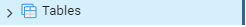

---

Creación de la tabla:

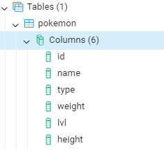

---

# CREATE

Antes del insert de un Pokémon:

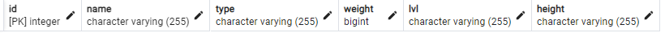

---

Insert del Pokémon:

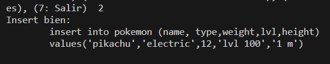

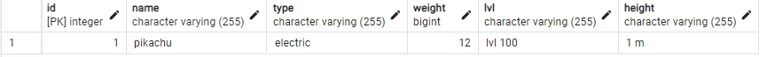
---

# READ

---

Select:

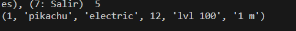

---

# UPDATE

Actualizo el dato:

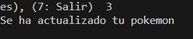

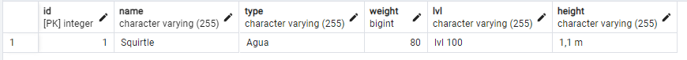
---

Muestro el dato nuevo:
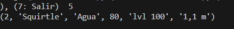
---

# DELETE

Eliminando un dato:

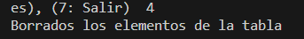
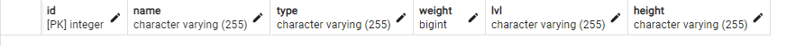

---

Tabla borrada:

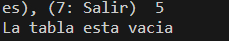
-
